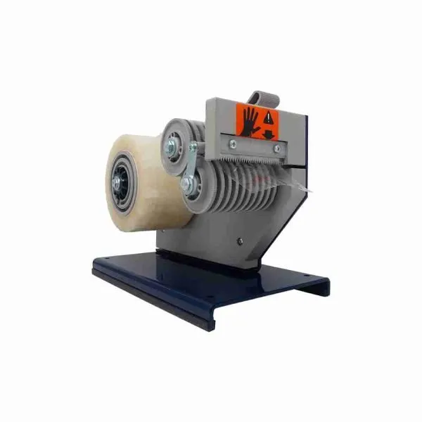

# Shipping Process Improvement Proposal: Tape Dispenser

**Status:** 📝 Complete, Awaiting Submission  
**Date:** January 2026  
**Author:** Support Engineering

---

## Summary

This proposal recommends implementing an automatic definite-length tape dispenser to streamline the laptop shipping process within Support Engineering. The current workflow stores original laptop boxes assembled to save time during packing, which significantly increases storage footprint and limits inventory capacity.

The proposed solution requires a one-time investment of **$647.20**, with no ongoing consumable costs. This investment will enable efficient box flattening and reassembly, reducing storage footprint by approximately **80%** while also reducing box sealing time compared to manual tape guns. A lower-cost manual alternative is also presented.

---

## Current State

### Shipping Volume

Based on delivery confirmations from the FedEx shared mailbox (2-month retention period), Support Engineering ships approximately **78 laptops per month** from Bellevue. These shipments support new hire onboarding, break/fix replacements, and hardware refresh cycles.

### Current Box Storage Process

The existing process for managing reusable laptop packaging involves the following:

- Original laptop boxes are retained for redeployment shipments
- Boxes are stored assembled to minimize preparation time when shipping
- Storage area is dedicated to holding assembled boxes ready for immediate use
- Technicians use manual tape guns to seal packages for shipment
- Average tape length required to seal a package is 18 to 24 inches per strip

### Identified Pain Points

| Issue | Impact |
|-------|--------|
| **Excessive storage footprint** | Assembled boxes consume approximately 5x the space of flattened boxes |
| **Limited inventory capacity** | Current storage constraints limit the number of boxes that can be kept on hand |
| **Time-space trade-off** | Flattening boxes would save space but adds reassembly time without proper equipment |
| **Inconsistent tape application** | Manual tape guns require estimating tape length, leading to waste or insufficient coverage |
| **Manual tape gun inefficiency** | Using a handheld tape gun requires pulling, positioning, cutting, and smoothing tape for each seam — a repetitive process that adds up across 78 monthly shipments |

---

## Proposed Solution

We recommend purchasing an automatic definite-length tape dispenser for the shipping workstation. This equipment automatically feeds and cuts pre-measured lengths of tape, enabling efficient box reassembly without adding significant time to the shipping process.

### Recommended Equipment

| Item | Details |
|------|---------|
| **Dispenser** | Tach-It 6100-SS Automatic Definite Length Tape Dispenser |
| **Operation** | Electric powered (110V); automatic feed and cut |
| **Cutting Method** | Guillotine blade — clean, smooth edge |
| **Safety** | Safety shield for operator protection |
| **Design** | Compact tabletop; LED display and push-button controls |

### Key Benefits

- **80% storage reduction:** Flattened boxes occupy approximately one-fifth the space of assembled boxes
- **Exact tape lengths every time:** Digital controls dispense precise, pre-programmed lengths without multiple pulls or guesswork — easily handles the 18–24 inch strips typically needed for package sealing in a single automatic cycle
- **Automatic feed and cut:** Feeds the next tape strip as soon as the previous one is removed, eliminating manual effort
- **Guillotine cutting:** Clean, smooth tape edges versus the jagged cuts from serrated-edge dispensers or tape guns, which can cause tape to split at the end resulting in inconsistent cuts and wasted material
- **Enhanced safety:** Enclosed safety shield protects operator from the cutting mechanism
- **Faster box sealing:** Pre-cut tape strips eliminate the pull-position-cut-smooth cycle of manual tape guns
- **Improved ergonomics:** Eliminates repetitive tape pulling and tearing motions associated with handheld tape guns

---

## Alternate Option

If budget is a constraint, the **Tach-It SL-3 Manual Definite Length Tape Dispenser** is available at **$203.00**. This manual model uses a lever-action mechanism to dispense tape.

| Item | Details |
|------|---------|
| **Dispenser** | Tach-It SL-3 Manual Definite Length Tape Dispenser |
| **Operation** | Manual lever action — no power required |
| **Cutting Method** | Serrated blade — operator pulls tape against edge to cut |
| **Safety** | Open blade design (no safety shield) |
| **Design** | Tabletop with weighted base; can be mounted |

### Trade-offs of the Alternate Option

| Feature | SL-3 Manual | 6100-SS Automatic |
|---------|-------------|-------------------|
| **Tape dispensing** | Multiple lever pulls required (max 8" per pull = 3 pulls for 18-24" strip) | Full length in single automatic cycle |
| **Ergonomics** | Repetitive stress risk from multiple lever pulls | Eliminates physical effort entirely |
| **Cut quality** | Serrated blade produces jagged edges that can split | Guillotine blade delivers clean, smooth cuts |
| **Feeding** | Manual pull required for each strip | Automatic feed when previous strip removed |
| **Safety** | Open blade design exposes cutting edge | Enclosed safety shield for protection |
| **Length control** | Manual thumb screw adjustment | Digital push-button controls with mm precision |

---

## Contingency

In the event of equipment malfunction, standard tape guns remain available as a backup. This ensures no disruption to shipping operations while repairs or replacement are coordinated.

---

## Cost Analysis

### Recommended Option — Vendor Comparison

| Item | Vendor | Cost |
|------|--------|------|
| [Tach-It 6100-SS Automatic Tape Dispenser](https://tach-it.com/product/6100-ss-tape-dispenser/) | **tach-it.com (recommended)** | **$647.20** |
| [Tach-It 6100-SS Automatic Tape Dispenser](https://www.amazon.com/Tach-6100-SS-Semi-Automatic-Definite-Dispenser/dp/B00G9QTMQW) | Amazon Business | $655.97 |
| **Ongoing Annual Cost** | — | **$0.00** |

### Alternate Option — Vendor Comparison

| Item | Vendor | Cost |
|------|--------|------|
| [Tach-It SL-3 Manual Tape Dispenser](https://tach-it.com/product/sl-3-tape-dispenser/) | **tach-it.com (recommended)** | **$203.00** |
| [Tach-It SL-3 Manual Tape Dispenser](https://www.amazon.com/dp/B01AYKED4Y) | Amazon Business | $396.56 |
| **Ongoing Annual Cost** | — | **$0.00** |

> **Note:** Purchasing directly from tach-it.com (manufacturer) provides significant savings: $8.77 on the 6100-SS and $193.56 on the SL-3 compared to Amazon Business pricing.

### Return on Investment

While the primary value of this investment is in storage efficiency and process improvement rather than direct cost savings, there are measurable benefits:

- Approximately 80% reduction in box storage footprint
- Increased box inventory capacity without additional storage space
- Time savings on each shipment by replacing manual tape gun operation with automatic tape dispensing
- Reduced tape waste through consistent, measured cuts
- Enhanced operator safety with enclosed blade mechanism
- Minimal training required — intuitive push-button controls

---

## Implementation Timeline

| Timeframe | Activity |
|-----------|----------|
| **Week 1** | Approval and procurement via tach-it.com |
| **Week 2** | Delivery and setup at shipping workstation |
| **Week 2–3** | Technician orientation and initial box flattening initiative |
| **Week 3+** | Full deployment — flattened box storage standard practice |

---

## Recommendation

We recommend approving the purchase of the **Tach-It 6100-SS Automatic Definite Length Tape Dispenser** at a total cost of **$647.20**. This powered model offers significant advantages over manual alternatives: exact tape lengths with every use, automatic feed-and-cut operation, a clean guillotine blade cut, and enhanced operator safety features. If budget constraints require a lower-cost option, the Tach-It SL-3 Manual Tape Dispenser at $203.00 provides core functionality with a manual lever mechanism.

> This proposal is part of a broader initiative to optimize the laptop shipping and receiving process. Additional improvements, including standardized user instruction sheets, will be addressed in subsequent proposals.
